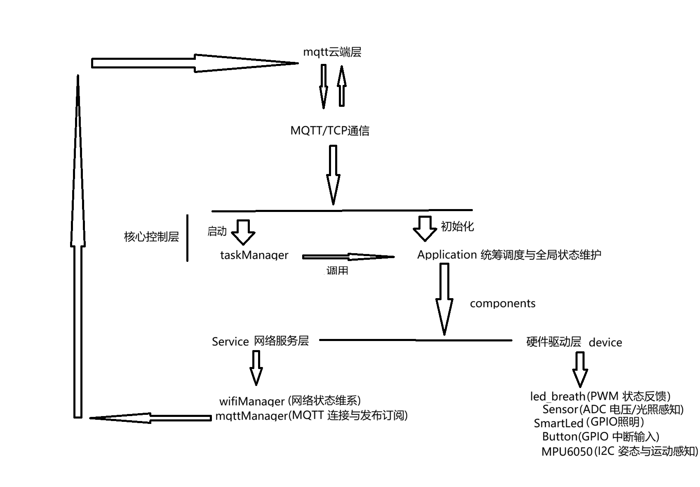
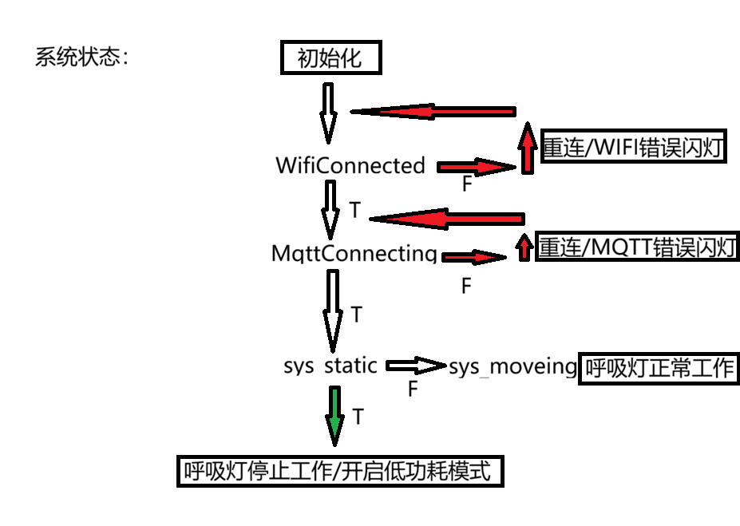

#  Project_introduction：
本项目基于ESP-IDF框架开发的ESP32IoT项目，采用c++面向对象思想，结合freeRTOS，实现传感器采集，本地控制，云端上报功能

---
##  核心功能：
* **根据环境控制设备**：通过 ADC 读取模拟电压自动控制 LED 亮灭；支持边缘检测机制以避免状态冲突
* **低功耗移动检测**：引入MPU6050六轴传感器，通过通过计算加速度与陀螺仪数据方差判断设备是否静止或移动来开启低功耗模式
* **非屏幕端系统状态实时监测**：基于FreeRTOS的EventGroup构建全局状态组，将Wi-Fi 状态，MQTT 状态，设备运动状态 解耦并统一管理。结合 LEDC 硬件 PWM 控制器，系统能够根据当前的WIFI和MQTT链接状态以及设备移动状态使呼吸灯以不同形式工作，提供直观系统状态反馈
* **中断与并发管理**：基于 FreeRTOS的二值信号量和防抖动触发，规划多个任务解耦传感器采集，LED和呼吸灯控制，网络发布逻辑

---
##  系统架构
代码按照高内聚，低耦合划分，在task中的逻辑集中到application

* **Application 层**：包含 wifiManager 与 mqttManager，负责通信
* **Device 驱动层**：包含 Sensor、MPU6050、Button 以及 SmartLed  led_breath (PWM) 等底层硬件控制

---

##  数据流向
为了更清晰地展示系统的底层数据运行机制，本项目的逻辑流转分为**1.业务宏观视角**与**2.底层代码视角**两层：
* 1.业务宏观视角：

	1.1数据采集：固定时刻触发 Sensor 采集，生成原始数据 (SensorData)。

	1.2数据处理中枢：Application 作为系统大脑，负责核心的数据清洗与边缘检测，输出有效业务数据 (currData)。

	1.3数据消费终端：处理后的数据分为双流向——本地直接触发 LED 智能亮灭控制，云端则通过 mqttManager 实时发布至 EMQX 节点。

* 2.底层代码视角：

	2.1系统状态流：MPU6050、wifi_event、mqtt_event 的异动汇聚到 sys_state 事件组，并指挥底层的 led_breath 做出视觉反馈

	2.2业务数据流 ： 传感器采集数据（sensorlist_task）， 清洗后得到业务数据 (Sensor公有变量sensorList[10])，随后分发给本地控制 (led_control_task) 自动开关灯，并同步给云端上传 (mqtt_publish_task)。

| 视角 | 详细文档 |
| :--- | :--- |
| **业务视角** | [查看流向图](docs/任务与数据流向图（业务视角）.png) |
| **代码视角** | [查看流向图](docs/任务与数据流向图（代码视角）.png) |

---

##  状态机逻辑
* 本项目根据freeRTOS的EventGroup来维护全局状态，确保在网络错误/设备静止时，系统可以优雅的进行系统状态设置/功耗控制/异常修复

* 在逻辑处理顺序中中我认为wifi错误判定要优先于mqtt错误判定，因为若wifi错误必将mqtt错误，此时讨论mqtt错误无任何意义；当wifi和mqtt都正常工作时，我们才再次判定系统是否处于静止或非静止状态，以此来决定是否开启低功耗模式

---

##  Module Details：
* Application:系统类采用单例模式。初始化所有底层对象，维护全局状态事件组，并提供业务逻辑接口供各 Task 调用，降低业务逻辑和任务之间的耦合

* taskManager: 负责创建和管理 FreeRTOS 任务流，处理任务间的延时和阻塞逻辑。以及自动开启设备低功耗模式

* wifiManager / mqttManager: 封装了 ESP-IDF 的 WiFi 和 MQTT 客户端逻辑，包含 NVS 初始化、事件回调注册及自动重连机制。

* MPU6050: 基于 I2C 协议读取 6 轴姿态数据，内部包含方差计算算法以判断设备是否处于移动状态。

* Sensor: 基于 ADC OneShot 模式读取模拟电压,得到虚拟光照值，支持多次采样得到平均值存入sensorlist，并提供对外接口得到通过平滑滤波后的虚拟光照值。

* Button: 封装了 GPIO 外部中断逻辑。

* SmartLed / led_breath: 分别封装了基础的 GPIO 高低电平控制和基于 LEDC 定时器的 PWM 呼吸灯控制，以及不同的系统状态对应不同的呼吸灯状态的对外接口

---

##  运行截图与 MQTT 截图:
	我模拟了开机正常运行后停止移动1，停止移动设备 感知到静止状态开启开启低功耗模式2，断开网络3，开启网络设备回复正常的运行逻辑4

| **非低功耗模式：** | [非低功耗模式](docs/2378920291a4a0ce34216d20c1b424f0.png) | 
[前半部分](docs/2378920291a4a0ce34216d20c1b424f0.png)|

| **低功耗模式：** | [查看流向图](docs/屏幕截图_2026-06-25_153500.png) |[前半部分](docs/屏幕截图_2026-06-25_154205.png)|

| **断开网络** | [查看流向图](docs/屏幕截图_2026-06-25_153618.png) |

| **恢复网络** | [查看流向图](docs/屏幕截图_2026-06-25_153732.png) |

---

##  Project Highlights
* 基于c++面向对象的系统架构设计：

		我放弃了传统面向过程的c语言，采用了c++对ESP-IDF底层API进行封装，实现内部处理，暴露公用逻辑接口；在application采用单例模式统筹全局，各个外设(MPU6050,Sensor,Button）和网络服务（MQTTManager,WIFIManager）,实现高内聚，低耦合的系统架构

*	防抖动机制：

		引入EventGroup状态机管理，分离了“网络维系任务”与“业务数据发布任务”，当 Wi-Fi 信号丢失或 MQTT Broker 异常时，系统会切断关于网络端发布数据流，避免底层 Socket 阻塞崩溃，并在后台重试，网络恢复后接管业务。

*	动态功耗自适应：

		在设备端引入姿态方差计算，利用 MPU6050 采样，实时计算运动方差，当判定设备进入静止(sys_static)状态时,主动降低系统资源开销与云端上报频率,一旦检测到扰动，立即级唤醒并恢复高频工作态。

*	任务间通信与解耦：用 FreeRTOS 的多种进程间通信机制:

		利用Queue实现从传感器采集端到消费端的数据沟通

		利用二值信号量处理外部异步中断ISR与任务的同步

		利用EventGroup实现多个不同设备状态的集中处理，底层各个组件（wifi,mqtt,mpu6050）各自输出各自的状态位,由Application将这些分散的硬件状态位“聚合”到一个中央事件组中，再通过特定的业务逻辑将其映射为高层的系统枚举类型（SystemState），供其他任务进行高效、解耦的单点查询与轮询，既保留了底层多事件的并发独立性，又简化了上层业务的判定逻辑

---

##  遇到的问题与解决过程
*	C++ 面向对象封装与 FreeRTOS C 语言 API 的兼容性冲突：

				问题描述：在进行面向对象重构时，尝试直接将类的成员函数（如 taskManager 里的任务函数）作为 xTaskCreate 的回调入口，导致严重的编译错误。原因是 C++ 类的非静态成员函数隐含了 this 指针，与 FreeRTOS 要求的 C 风格函数签名不匹配。
				解决过程：在taskManager类中把任务函数声明为 static，这样可以把this 指针给剥离掉，并在创建任务时，将对象实例自身（this）通过 pvParameters 传递进去。在静态函数内部，将传入的 void* 强转回 taskManager* 并调用真实的业务逻辑，实现C++的现象对象功能与底层的桥接

*	临界状态下的物理环境毛刺导致频闪：

			问题描述：测试中发现，当环境光线处于临界阈值时，ADC 采样数据存在细微的硬件底噪，导致 led_control_task 频繁在亮与暗之间反复横跳，造成 LED 狂闪，以及人为触发led亮灯功能无效
			解决过程：在底层采集Sensor 类，引入软件均值滤波（连续采集 10 次存入数组并计算平均值）在上层决策端（Application::Auto_led），设定 >1000 判亮，<750 判暗，与此同时配合上一次状态（last_state）的边缘检测，消除了物理底噪引发的逻辑震荡，和人为触发led亮灯逻辑与自动检测当前光照值并处理led亮不亮的逻辑冲突问题
		
*	中断上下文ISR中的同步与机械防抖问题

			问题描述：使用按键外部中断时，机械按键的抖动会导致一次按下触发多次中断。且早期试图在 ISR 中直接执行耗时操作，导致内核报错甚至崩溃。
			解决过程：在 GPIO 外部中断 ISR 中（上半部），用esptimerget_time() 记录时间戳进行180ms的纯软件防抖，通过 xSemaphoreGiveFromISR 释放二值信号量退出。由一直处于阻塞等待的 short_button_task（下半部）接管并执行 LED 状态切换等耗时的业务逻辑。保证了中断的高效，实现了业务的安全同步。

---

##  遇到的问题与解决过程
* 功能改进：

		传感器数据上报策略优化：当下的发布逻辑是固定时刻发送当前数据，我认为持续发送会导致占用管带和数据冗余，占用存储资源，所以我在未来的规划中打算引入阈值触发上报：如果当前光照数据稳定可不发送，当超过给定区间触发mqtt上报，稳定的时候只是在本地做逻辑控制

* 架构重构与代码优化：

		Application类与taskManager类解耦与事件驱动:
			在taskManager类中强引用了Application.h,包含了整个系统，导致taskManager繁重，所以我在未来可能会使用esp_event 自定义事件循环，解耦Application类与taskManager类

		MQTT数据流调度模型重构：
			当下是sensorlist_task中光感数据发送到queue，在MQTTpublshTask异步接收，若系统低功耗模式下，存在生产者与消费者之间的速率不匹配问题，目前仅仅是清除过去数据，虽然保证数据时效性，但数据处理与业务逻辑存在部分耦合。所以我在未来可能会使用环形缓冲区或专用的覆盖式队列将“丢弃旧数据、只发最新数据”的策略从业务逻辑中解耦出来，让Application 的业务层更专注于传感器数据的处理，提升架构的可测试性与代码复用度。	

		参数动态配置化：
			目前在配置Wi-Fi，MQTT Broker 地址，Topic 节点采用硬编码，写死了，未来可能会采用通过公共接口，或者是引入微信小程序配网或基于NVS的Web Server配网页面，提高设备灵活性，实现真正通用落地能力
---
## 未来优化方向:
*	功能改进：

			传感器数据上报策略优化：
					当下的发布逻辑是固定时刻发送当前数据，我认为持续发送会导致占用管带和数据冗余，占用存储资源，所以我在未来的规划中打算引入阈值触发上报：如果当前光照数据稳定可不发送，当超过给定区间触发mqtt上报，稳定的时候只是在本地做逻辑控制

*	架构重构与代码优化：

		### Application类与taskManager类解耦与事件驱动：
				在taskManager类中强引用了Application.h,包含了整个系统，导致taskManager繁重，所以我在未来可能会使用esp_event 自定义事件循环，解耦Application类与taskManager类

		MQTT数据流调度模型重构：
				当下是sensorlist_task中光感数据发送到queue，在MQTTpublshTask异步接收，若系统低功耗模式下，存在生产者与消费者之间的速率不匹配问题，目前仅仅是清除过去数据，虽然保证数据时效性，但数据处理与业务逻辑存在部分耦合。所以我在未来可能会使用环形缓冲区或专用的覆盖式队列将“丢弃旧数据、只发最新数据”的策略从业务逻辑中解耦出来，让Application 的业务层更专注于传感器数据的处理，提升架构的可测试性与代码复用度。	
		
		参数动态配置化：目前在配置Wi-Fi，MQTT Broker 地址，Topic 节点采用硬编码，写死了，未来可能会采用通过公共接口，或者是引入微信小程序配网或基于NVS的Web Server配网页面，提高设备灵活性，实现真正通用落地能力

---
